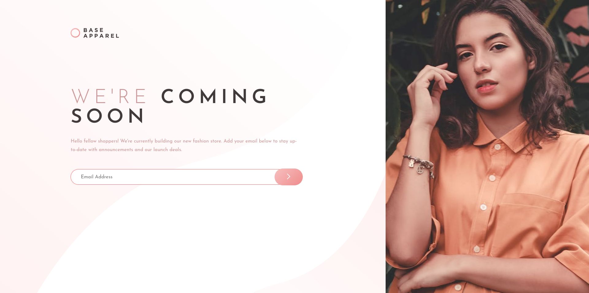
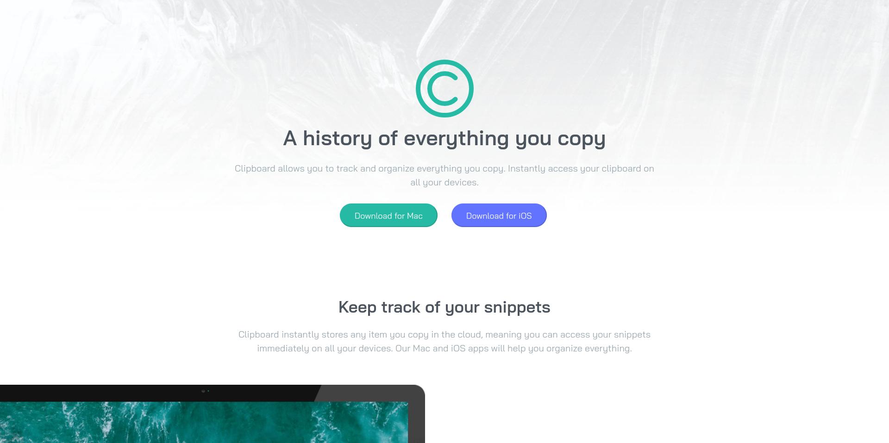
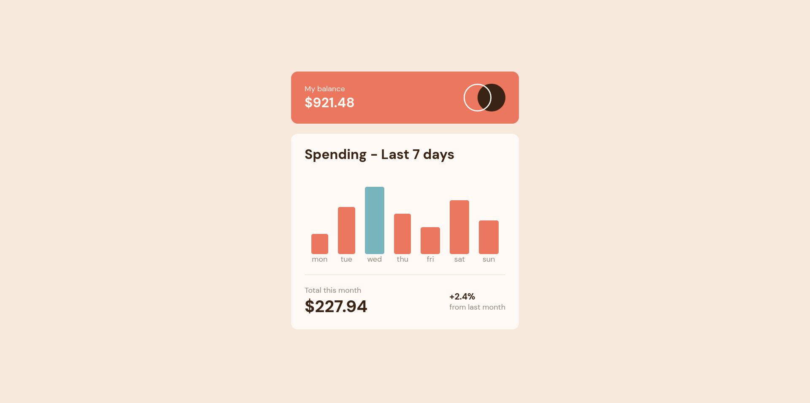
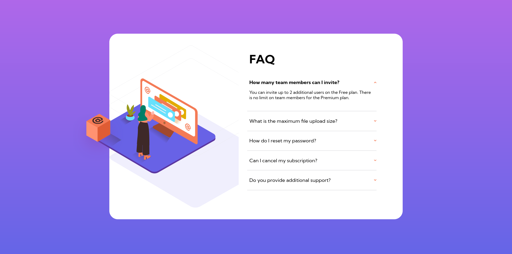
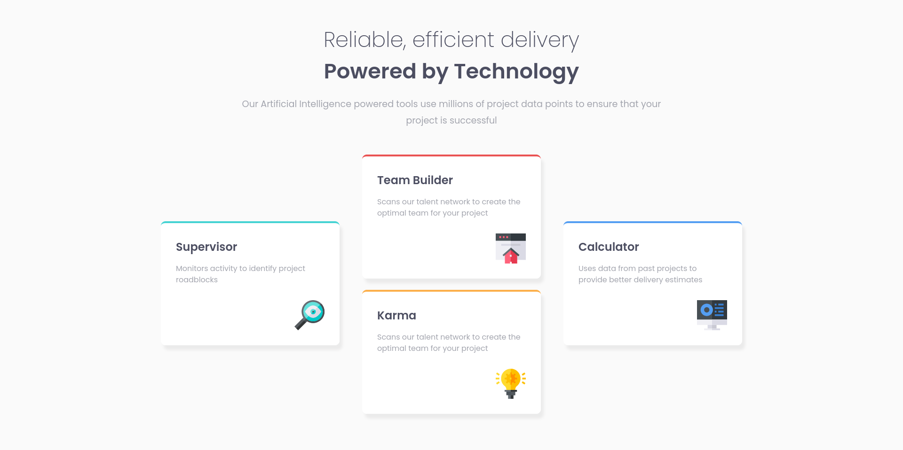
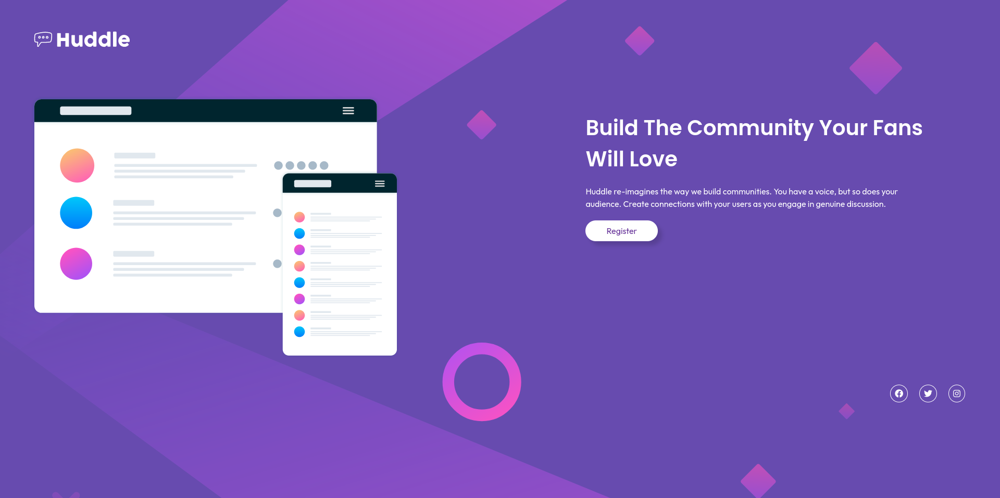
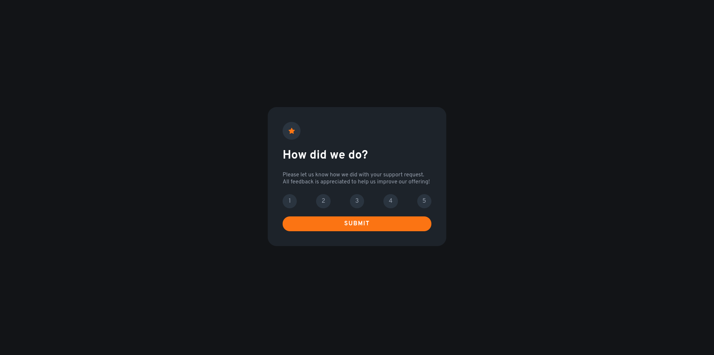
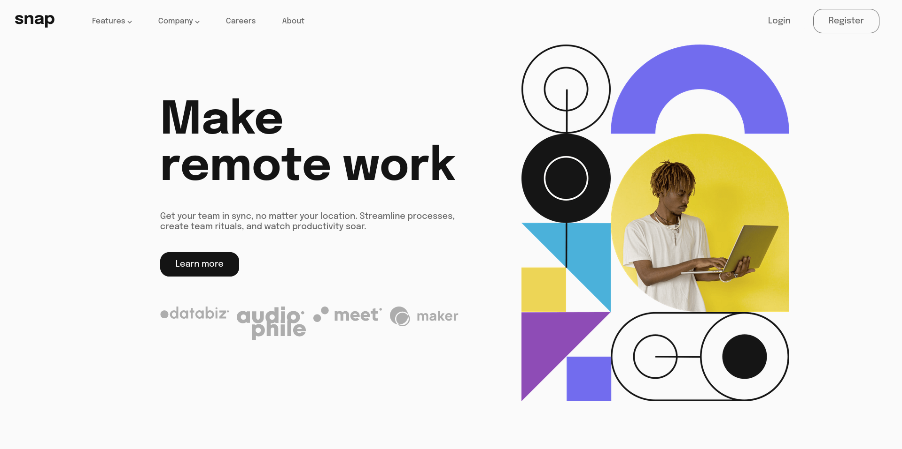
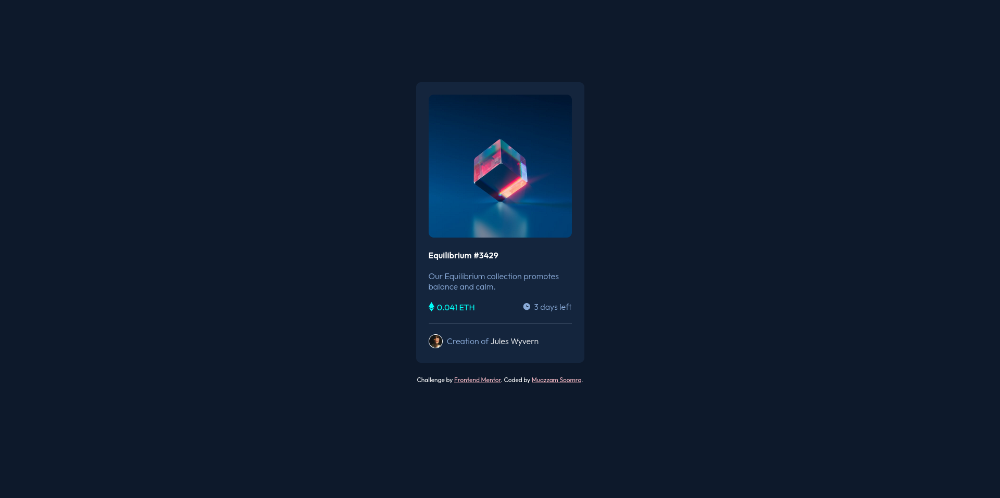
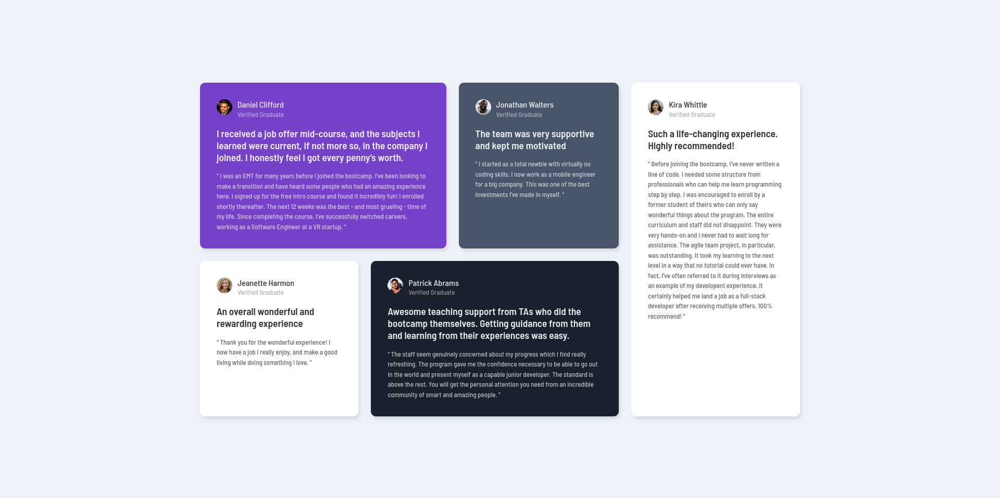

# Frontend Mentor Challenges Repository

This repository consists of all the challenges I have completed from Frontend Mentor.

To visit the live site of any of the projects, just add the repository name in front of the following link: [https://muazzy.github.io/Frontend-Mentor-Challenges](https://muazzy.github.io/Frontend-Mentor-Challenges/)
- Example: [Base Apparel Coming Soon](https://muazzy.github.io/Frontend-Mentor-Challenges/base-apparel-coming-soon-master)

---

## Completed Challenges

1. **Base Apparel Coming Soon**

   

 

2. **Clipboard Landing Page**

   

 

3. **Expenses Chart Component**

   

 

4. **FAQ Accordion Card**

   

 

5. **Four Card Feature Section**

   

 

6. **Huddle Landing Page with Single Introductory Section**

   

 

7. **Interactive Rating Component**

   

 

8. **Intro Section with Dropdown Navigation**

   

 

9. **NFT Preview Card Component**

   

 

10. **Testimonials Grid Section**

   

---

Hop on to [Frontend Mentor](https://www.frontendmentor.io/challenges) if you also wish to participate in these challenges!!
