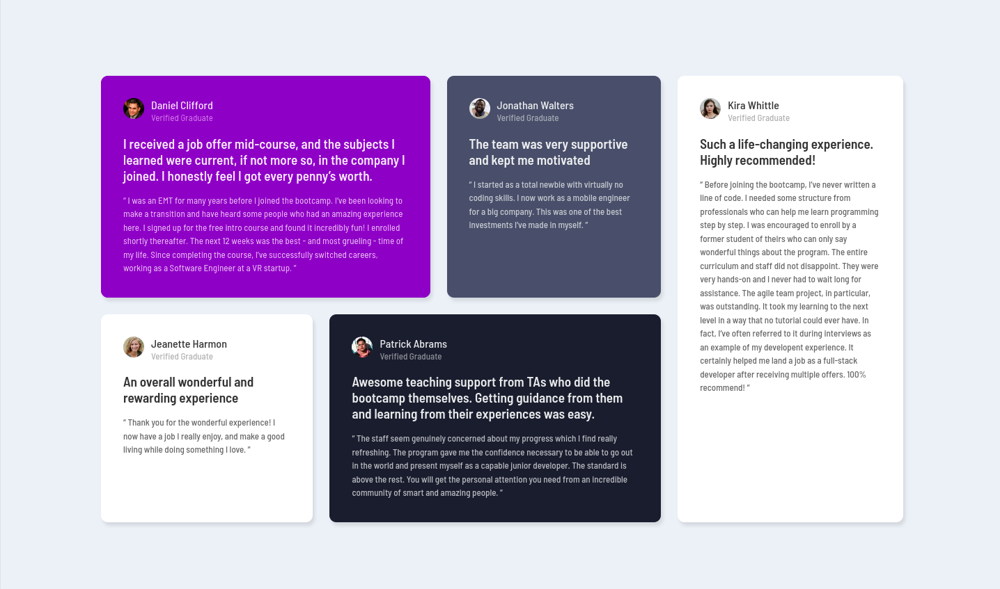

# Frontend Mentor - Testimonials Grid Section

## Welcome! 👋

### The challenge

Your users should be able to:

-View the optimal layout for the page depending on their device's screen size

### Screenshot

### Links

- Solution URL: [Solution](https://www.frontendmentor.io/solutions/testimonials-grid-section-using-css-grid-grid-template-areas-MxFrwpTVX6)
- Live Site URL: [Live site](https://muazzy.github.io/Frontend-Mentor-Challenges/testimonials-grid-section-main)

### Built with

- Semantic HTML5 markup
- CSS Grid